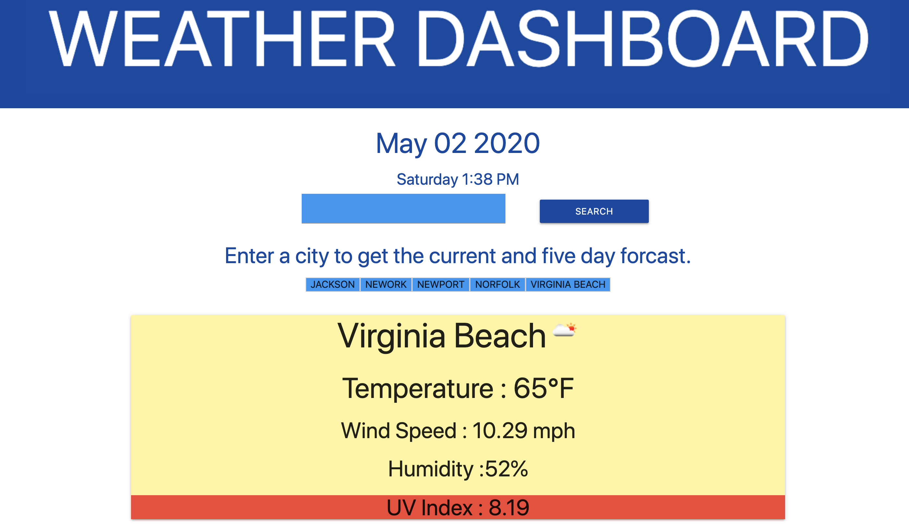

## Weather Dashboard
---
## Table of Contents
* [Description](#Description)
* [Installation](#Install)
* [Usage](#Usage)
* [Github](#Github)
* [Contact](#Email)
---

## Description
* This app retrieves data from another application's API. Weather-Dashboard then uses that data to create a forcast for current and five day weather forcast. This app keeps track of recent searches and displays current information for the last city search.

## Install
* No installation necessary simply visit 

## Usage
* Great application for people planning events and wanting to know the upcoming weather.

## Contributions
* If you would like to contribute please clone from my github page.

## Issues
* contact me

## Github
- Brewtoga

## Email
- George@george.com

## License
## 
